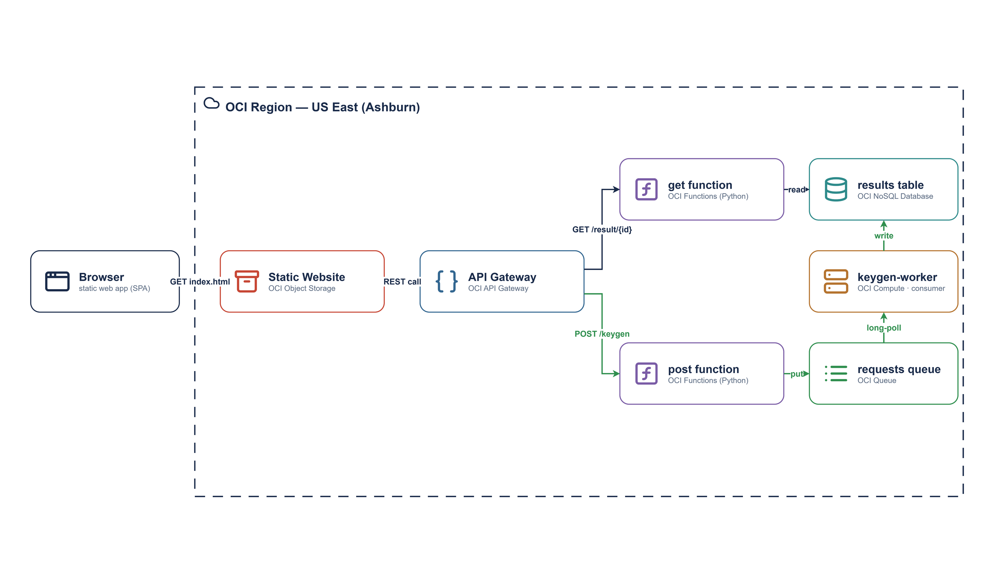

# OCI Async SSH KeyGen Microservice

This project delivers an automated **asynchronous SSH key generation service**
on OCI, powered by **OCI Queue**, **OCI Functions**, **OCI NoSQL Database**,
**API Gateway**, and a lightweight **queue-consumer VM**.

It uses **Terraform**, **Docker**, and **Python (OCI SDK + cryptography)** to
build a **message-driven key generation pipeline** that asynchronously processes
SSH keypair requests and stores completed results in NoSQL.

This is the OCI port of [`aws-sqs-keygen`](https://github.com/mamonaco1973/aws-sqs-keygen).

## Why a VM consumer instead of a serverless trigger?

The AWS original relies on an **SQS→Lambda event-source mapping**: a message on
the queue automatically invokes the worker in milliseconds. **OCI has no
first-class equivalent.** Two facts drove this design:

- **OCI Queue has no native compute trigger** — you must provide a consumer, or
  bridge it with an intermediary. There's no Functions config that auto-consumes
  the queue and invokes a worker the way SQS→Lambda does.
- **Service Connector Hub** *can* bridge Queue→Functions, but it's a
  batching/data-movement service, not a low-latency event-source mapping. Its
  batch time is configurable, yet in our testing we consistently observed **~30s
  or more** between enqueue and invocation — unacceptable for on-demand keygen.
  (Queue only became a valid Connector Hub source in Feb 2024.)

The fix that's both fast **and** cheap: keep `post`/`get` as serverless
Functions, and run the worker as a **long-polling consumer on a micro-VM**. OCI
Queue supports polling waits up to 30s that return the instant a message appears,
so processing is near-instant without hammering the Queue API.

> **The real substitution:** the VM isn't here because keygen *needs* a VM — it's
> implementing the piece of Lambda's control plane (the event-source mapping)
> that OCI Functions doesn't provide. AWS gives you a *managed* consumer; on OCI
> you bring your own.

> **Cost footnote:** `VM.Standard.E2.1.Micro` is Always Free eligible (up to two
> instances), so the demo worker is effectively $0. Note that Oracle may reclaim
> Always Free compute that stays below its utilization thresholds over a 7-day
> window — a consumer blocked in long-poll can look idle — so treat the free
> shape as an excellent demo/zero-cost option, with a small paid shape
> (`export TF_VAR_instance_shape=...`) as the production fallback.

| AWS building block | OCI equivalent used here |
|--------------------|--------------------------|
| SQS queue | OCI Queue |
| SQS→Lambda event-source mapping | Long-polling consumer on a micro-VM |
| Lambda (post / get) | OCI Functions (one image, two functions) |
| Lambda (worker) | systemd consumer daemon on the VM |
| Amazon ECR | OCI Container Registry (OCIR) |
| DynamoDB (+ TTL) | OCI NoSQL Database (row TTL) |
| API Gateway (HTTP API) | OCI API Gateway |
| S3 static website | OCI Object Storage static site |
| IAM roles | Dynamic Groups + policies + Resource/Instance Principals |

## Architecture



1. **POST `/keygen`** — the post function generates a `request_id` (UUID4),
   puts the request on the Queue, and returns **202 Accepted** immediately.
2. **Worker VM** long-polls the Queue, generates the keypair (`cryptography`),
   writes it to NoSQL, and deletes (acks) the message.
3. **GET `/result/{id}`** — returns **202** while pending and **200** with the
   base64-encoded keypair once the worker has stored it.

Keys expire from NoSQL automatically after one day (table TTL). A `GET /heartbeat`
endpoint returns a fast 200; the web client pings it once a minute to keep the
result-polling function warm.

## API Endpoints

### POST /keygen

```json
{ "key_type": "rsa", "key_bits": 2048 }
```

`key_type` is `rsa` (default) or `ed25519`; `key_bits` applies to RSA only.
Returns `{ "request_id": "…", "status": "queued" }`.

### GET /result/{id}

**202** while pending: `{ "status": "pending", "correlation_id": "…" }`.
**200** once complete (keys base64-encoded):

```json
{
  "correlation_id": "…",
  "status": "complete",
  "key_type": "rsa",
  "public_key_b64": "…",
  "private_key_b64": "…",
  "created_at": "…Z"
}
```

## Prerequisites

- `oci`, `terraform`, `docker`, `jq`, `envsubst` in your PATH
- OCI CLI configured (`~/.oci/config` with an API key)
- Docker daemon running (local image build)
- Capacity for one always-free (or small) compute instance in your tenancy

## Deploy / Destroy / Validate

```bash
./apply.sh      # 5-phase deploy, then a smoke test
./destroy.sh    # tear everything down (reverse order)
./validate.sh   # smoke test only, after a deploy
```

Optional: `export OCI_COMPARTMENT_ID=ocid1.compartment...` (defaults to tenancy root).

`apply.sh` phases:

1. **01-queue** — OCIR repository + OCI Queue
2. **02-docker** — build the functions image, push to OCIR
3. **03-functions** — Functions (post/get), NoSQL, VCN, API Gateway, IAM
4. **04-worker** — the queue-consumer VM (cloud-init installs + starts the daemon)
5. **05-webapp** — inject the API URL into the HTML, deploy to Object Storage

## The worker VM

`04-worker` provisions a micro-VM (default `VM.Standard.E2.1.Micro`, an
always-free shape) that runs [`consumer.py`](04-worker/consumer.py) as a systemd
service (`keygen-worker`). It authenticates via **instance principals** (no keys
on the box) and long-polls the Queue. A generated SSH key is written to
`04-worker/worker_key.pem` for debugging:

```bash
terraform -chdir=04-worker output -raw worker_ssh_command   # ssh in
sudo journalctl -u keygen-worker -f                          # tail the daemon
```

If your tenancy is out of always-free capacity, override the shape:
`export TF_VAR_instance_shape="VM.Standard.E4.Flex"` (note: not free).

## Web Client

A static page hosted in Object Storage (`05-webapp`) lets you generate a keypair
from the browser: pick the key type/size, submit, and it polls until the keys
appear. The API base URL is injected at deploy time.
